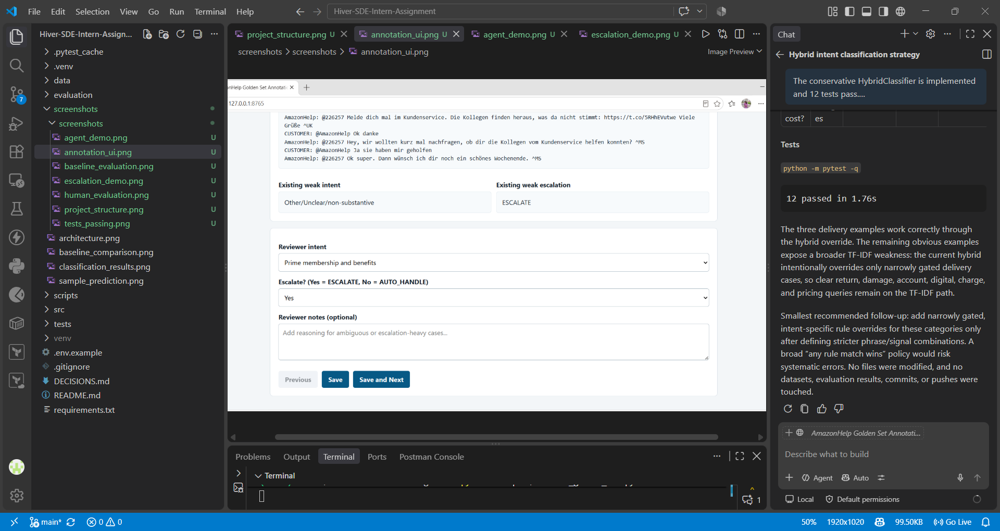
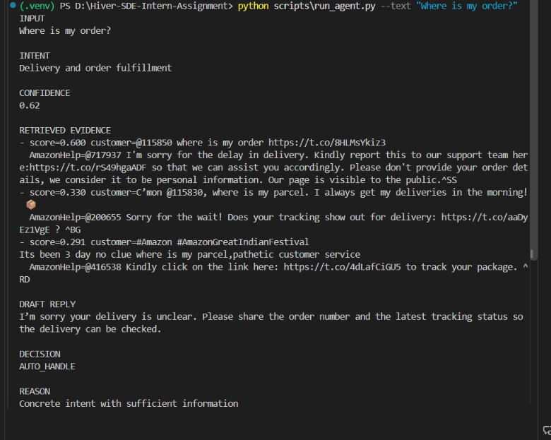
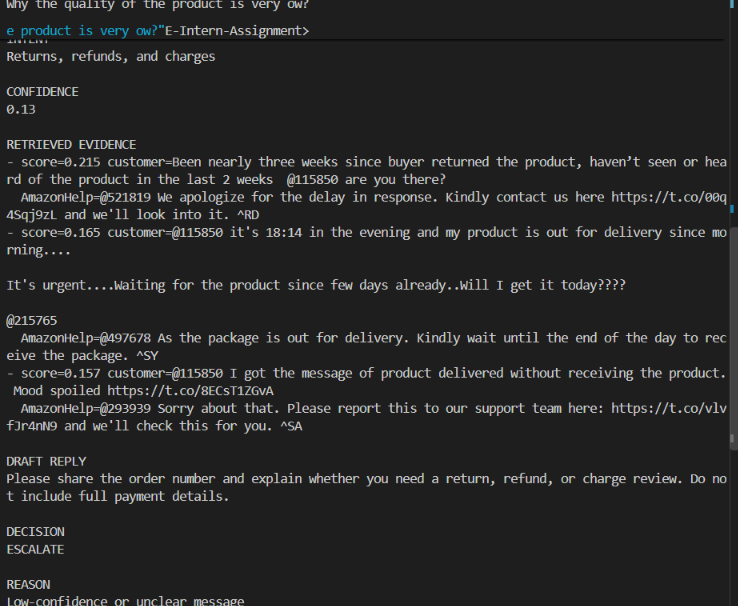
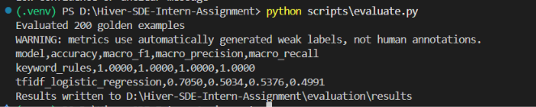
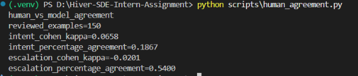
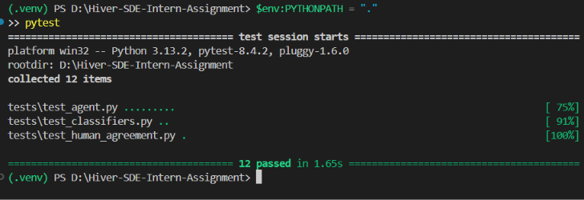
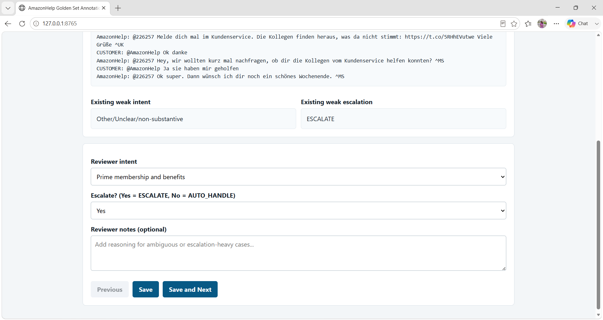

# AI Customer Support Agent for AmazonHelp

## 1. Problem

This project builds a reproducible customer-support agent for AmazonHelp conversations from the Customer Support on Twitter dataset. The agent classifies incoming messages, retrieves similar historical support exchanges, drafts a grounded reply, and decides whether the case should be auto-handled or escalated.

## 2. Solution

The prototype combines:

- A fixed nine-intent taxonomy.
- A transparent keyword-rule classifier baseline.
- A TF-IDF plus logistic-regression classifier baseline.
- A conservative `HybridClassifier` used by the project agent.
- TF-IDF retrieval of historical AmazonHelp exchanges.
- Deterministic fallback response generation, with optional OpenAI-compatible generation.
- An explicit escalation policy for security, legal, payment, low-confidence, and unclear cases.

The default demo runs locally and does not require an API key.

## 3. Architecture

```text
customer message
      |
      v
hybrid intent classifier ---> confidence ---> escalation policy
      |
      v
TF-IDF historical retrieval ---> evidence
      |
      v
grounded response generation
      |
      v
structured CLI output
```

## 4. Dataset

The project uses the Customer Support on Twitter dataset, selecting AmazonHelp conversations with direct AmazonHelp responses. The full raw dataset is intentionally excluded from Git because of its size. Place it locally at:

```text
data/raw/twcs/twcs.csv
```

The local copy used during development contained 2,811,774 rows. Conversation roots are reconstructed using `in_response_to_tweet_id`.

## 5. Brand Selection

AmazonHelp was selected because it provides a large and varied support domain, including delivery, order fulfillment, returns, account access, devices, digital products, Prime, pricing, and customer-service escalation.

## 6. Sampling

Conversation roots were selected deterministically with seed 42. Training, retrieval, and evaluation are split by conversation root to reduce leakage. The project contains two distinct evaluation artifacts:

- `evaluation/golden_set.csv`: a 200-row weak-label smoke-test set. Its labels were generated by the keyword rules and are not human ground truth.
- `evaluation/golden_set_150.csv`: a 150-row manually labelled primary human-evaluation set, used for human-vs-model agreement.

The separate `evaluation/human_training_set.csv` contains 90 manually reviewed training examples. It is used for model training when complete and remains separate from the 150-example evaluation set.

## 7. Intent Taxonomy

The agent keeps the existing nine-intent taxonomy:

1. Delivery and order fulfillment
2. Customer service escalation and feedback
3. Product condition, item accuracy, and seller issues
4. Digital products, devices, and apps
5. Prime membership and benefits
6. Returns, refunds, and charges
7. Pricing, offers, and product availability
8. Account access and security
9. Other/Unclear/non-substantive

Definitions and inclusion boundaries are documented in `DECISIONS.md`.

## 8. Agent Workflow

`SupportAgent` classifies the customer message, retrieves three similar customer-to-AmazonHelp examples, generates a concise response grounded in the evidence, and applies the escalation policy.

The current conservative hybrid strategy keeps TF-IDF as the main classifier. A narrow rule override is used only when the rule classifier identifies a high-confidence delivery intent and the message contains an explicit delivery signal such as tracking, package, parcel, order status, or a missing arrival. Ambiguous messages remain on the TF-IDF path. The project intentionally avoids many brittle keyword overrides that could create systematic errors.

## 9. Example Demo

```powershell
python scripts\run_agent.py --text "Where is my order?"
```

The representative delivery query is classified as `Delivery and order fulfillment` with confidence `0.62` and decision `AUTO_HANDLE` in the current project state.

## 10. Baselines and Evaluation

Run the weak-label smoke-test evaluation with:

```powershell
python scripts\evaluate.py
```

These results use the 200-row `evaluation/golden_set.csv` weak-label set:

| Model | Accuracy | Macro F1 |
|---|---:|---:|
| Keyword rules | 1.0000 | 1.0000 |
| TF-IDF + Logistic Regression | 0.7050 | 0.5034 |

The results are written to `evaluation/results/`. They are pipeline smoke-test results, not human-performance measurements.

### What Is Misleading About My Headline Number?

The keyword-rule score of `1.0000` is misleading because the 200-row evaluation labels were generated by the same rule logic. It measures label reproduction, not independent accuracy or human agreement. The TF-IDF result is also measured against weak labels and must not be presented as performance against human ground truth.

## 11. Human-Reviewed Training and Evaluation

The 90-row `evaluation/human_training_set.csv` is a separate manually reviewed training resource. Its completed `reviewer_intent` labels may be used by `SupportAgent.from_project_files()` for training. It is not the primary evaluation set.

The primary human evaluation is `evaluation/golden_set_150.csv`, which contains 150 manually labelled examples and reviewer escalation labels. Run:

```powershell
python scripts\human_agreement.py
```

Latest recorded human-vs-model results:

| Metric | Result |
|---|---:|
| Intent Cohen's kappa | 0.0624 |
| Intent percentage agreement | 18.67% |
| Escalation Cohen's kappa | 0.0000 |
| Escalation percentage agreement | 55.33% |

These are human-vs-model agreement results, separate from the weak-label baseline results.

## 12. Human-Evaluation Failure Modes

The five recorded failure modes from the 150-example human evaluation are:

1. Digital products predicted as pricing: 10 cases.
2. Returns/refunds predicted as pricing: 8 cases.
3. Prime predicted as product condition: 6 cases.
4. Pricing predicted as product condition: 6 cases.
5. Returns/refunds predicted as product condition: 5 cases.

There were 122/150 intent mismatches and 67/150 escalation mismatches. Escalation mismatches were predominantly false escalations. The likely contributors include sparse minority classes, overlapping vocabulary, multilingual text, and context-dependent follow-ups.

## 13. LLM Judge

The optional LLM-judge implementation exists in `scripts/llm_judge.py`. It requires an `OPENAI_API_KEY`; that key was not configured for this project. No fake LLM-judge scores were generated, and LLM-judge/human agreement was not completed.

## 14. Failure Analysis

`evaluation/results/failure_analysis.json` contains recorded mismatches from the weak-label baseline run. The main limitation is that rule-generated labels favor the rule baseline and do not measure independent human agreement. The human evaluation additionally shows confusion among delivery, Prime, payment, product, pricing, and returns language.

## 15. Limitations and Next-Week Improvements

This is a reproducible prototype, not a production accuracy claim. It does not infer unavailable order data and does not call an LLM by default. The next improvements are to review more human-labelled examples, expand minority-intent training coverage, improve multilingual normalization and context handling, and configure a tested LLM adapter if required.

## 16. Screenshots

### Project in VS Code



### Working Agent Demo



### Escalation Example



### Baseline Evaluation



### Human Evaluation



### Tests Passing



### Annotation UI



## 17. Reproducibility and Leakage Prevention

Install dependencies and reproduce the pipeline from the repository root:

```powershell
python -m pip install -r requirements.txt
python scripts\prepare_data.py
python scripts\train_baselines.py
python scripts\run_agent.py --text "Where is my order?"
python scripts\evaluate.py
python scripts\human_agreement.py
python scripts\llm_judge.py
pytest
```

Golden conversation roots are recorded in `evaluation/conversation_split.csv`. Training and retrieval samples exclude those roots, so an evaluation conversation cannot retrieve its own historical response. The raw TWCS file must be supplied locally at `data/raw/twcs/twcs.csv` and is not committed.

## 18. Project Structure

```text
src/                  taxonomy, data loading, classifiers, retrieval, agent
scripts/              preparation, training, demo, evaluation, annotation tools
evaluation/           weak-label set, human set, split, training/retrieval data
tests/                unit tests
screenshots/          project, demo, evaluation, and annotation screenshots
DECISIONS.md          engineering decisions and taxonomy evidence
```

## 19. Manual Annotation UI

The local annotation UI reviews one example at a time and saves reviewer fields. For the 150-example evaluation set, it saves `reviewer_intent`, `reviewer_expected_escalation`, and `reviewer_notes` in `evaluation/golden_set_150.csv`. It does not generate labels.

Start it from the repository root:

```powershell
venv\Scripts\python.exe scripts\annotate_golden_set.py
```

Open `http://127.0.0.1:8765/`. To use another port:

```powershell
venv\Scripts\python.exe scripts\annotate_golden_set.py --port 8766
```

To annotate the separate 90-example human-training set:

```powershell
venv\Scripts\python.exe scripts\annotate_golden_set.py --csv evaluation\human_training_set.csv
```

## 20. Key Engineering Principles

- Keep the nine-intent taxonomy stable and explicit.
- Separate weak-label smoke tests from human evaluation.
- Keep human training data separate from the primary evaluation set.
- Preserve independently evaluable classifier baselines.
- Prefer conservative, explainable routing over broad keyword overrides.
- Prevent conversation-root leakage between training, retrieval, and evaluation.
- Never fabricate metrics, judge scores, order data, or unsupported response claims.

## 21. Submission Note

This repository contains a CLI-based AI support-agent prototype for the Hiver SDE Intern take-home assignment. The documented results are the actual recorded results in the repository. The raw dataset is intentionally excluded from Git because of its size; evaluators should place it at `data/raw/twcs/twcs.csv` before running the full preparation pipeline.
